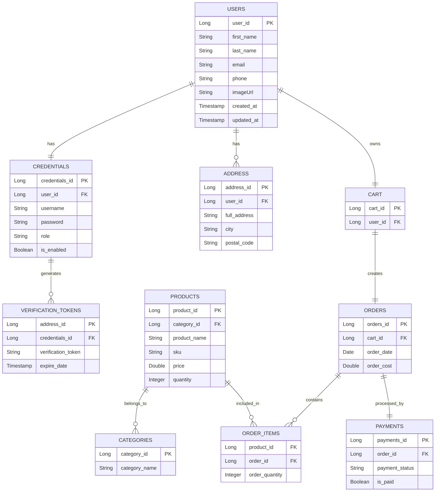

# 🛒 E-Commerce-Backend-Spring-Microservices
> **A highly scalable, production-grade distributed e-commerce backend built with Spring Boot Microservices.**

## 🏗 System Architecture

```mermaid
graph TD
    %% Client & Gateway
    Client[📱 Client / React UI]
    Gateway[🚪 API Gateway]

    %% Microservices
    UserService[👥 User Service<br/>(Auth & Profile)]
    ProductService[📦 Product Service<br/>(Catalog & Inventory)]
    OrderService[🛒 Order Service<br/>(Order Processing)]
    PaymentService[💳 Payment Service<br/>(Transactions)]

    %% Databases
    UserDB[(User DB)]
    ProductDB[(Product DB)]
    OrderDB[(Order DB)]
    PaymentDB[(Payment DB)]

    %% Connections
    Client -->|HTTPS| Gateway

    %% Gateway Routing
    Gateway -->|REST| UserService
    Gateway -->|REST| ProductService
    Gateway -->|REST| OrderService
    Gateway -->|REST| PaymentService

    %% Inter-Service Communication
    OrderService -.->|REST / Feign| UserService
    OrderService -.->|REST / Feign| ProductService
    OrderService -.->|REST / Feign| PaymentService

    %% Database Mapping
    UserService --- UserDB
    ProductService --- ProductDB
    OrderService --- OrderDB
    PaymentService --- PaymentDB
    
    classDef client fill:#2a9d8f,stroke:#264653,stroke-width:2px,color:#fff;
    classDef gateway fill:#e9c46a,stroke:#264653,stroke-width:2px,color:#000;
    classDef service fill:#f4a261,stroke:#264653,stroke-width:2px,color:#000;
    classDef db fill:#e76f51,stroke:#264653,stroke-width:2px,color:#fff;
    
    class Client client;
    class Gateway gateway;
    class UserService,ProductService,OrderService,PaymentService service;
    class UserDB,ProductDB,OrderDB,PaymentDB db;
```

## 🧠 Architecture Explanation

* **API Gateway**: Acts as the single entry point for all client requests, handling routing, cross-cutting concerns (CORS), and delegating to specific microservices.
* **Service-to-Service Communication**: Microservices communicate synchronously via lightweight REST APIs, ensuring strict contract boundaries.
* **Database-per-Service Pattern**: Each microservice encapsulates its own data store. This prevents domain leakage, allows independent schema evolution, and eliminates the single point of failure associated with monolithic databases.
* **Scalability & Loose Coupling**: Services are independently deployable and scalable. If the Order Service experiences high load, it can scale out without affecting the User or Product services.

## ✨ Core Features

* 🔐 **Authentication**: Stateless JWT-based authentication and authorization mechanism.
* 🛍️ **Product Catalog Management**: Robust inventory and product life-cycle handling.
* 📦 **Order Processing Workflow**: Distributed orchestration of order creation, verification, and fulfillment.
* 💳 **Payment Handling**: Isolated transactional logic for payment processing.
* 🚀 **High Scalability & Fault Isolation**: Failures in one domain (e.g., Payments) do not cascade to crash the entire platform.
* 🔄 **Independent Deployment**: CI/CD pipelines can deploy individual services with zero downtime.

## 🛠 Tech Stack

* **Backend Framework**: Spring Boot, Spring Cloud
* **Security Context**: Spring Security, JWT (JSON Web Tokens)
* **Inter-Service Communication**: REST APIs
* **Databases**: MySQL / PostgreSQL (Polyglot persistence supported)
* **Infrastructure**: Docker, Kubernetes

## 📊 Entity-Relationship Diagram (Database Schema)



## 🧩 Service Breakdown

### 1. User Service
* **Responsibilities**: Manages user identities, authentication, and profiles.
* **Key Operations**: User registration, login, profile management.
* **Data Ownership**: User credentials, roles, and profile information.

### 2. Product Service
* **Responsibilities**: Maintains the product catalog and tracks inventory levels.
* **Key Operations**: Browsing products, adding products, inventory decrement.
* **Data Ownership**: Product metadata, pricing, and stock quantity.

### 3. Order Service
* **Responsibilities**: Orchestrates the checkout process and manages order lifecycles.
* **Key Operations**: Creating orders, fetching order history, order status updates.
* **Data Ownership**: Order history, line items, and fulfillment status.

### 4. Payment Service
* **Responsibilities**: Processes financial transactions reliably and securely.
* **Key Operations**: Initiating payments, verifying transaction success.
* **Data Ownership**: Transaction logs, payment statuses, and billing records.

## 🔄 End-to-End Workflow

1. **Request Initiation**: User sends an HTTPS request (e.g., "Place Order") from the Client UI to the API Gateway.
2. **Routing**: The Gateway routes the payload to the **Order Service**.
3. **Orchestration**: Order Service begins coordinating the workflow.
4. **Service Interaction**: 
   * Validates user with **User Service**.
   * Checks stock and reserves items with **Product Service**.
   * Initiates the transaction with **Payment Service**.
5. **Data Persistence**: Each service updates its respective isolated database.
6. **Response Generation**: Order Service aggregates the result and returns the successful state back through the Gateway.

## 📈 Scalability & Design Highlights

* **Microservices Architecture**: Domain-driven boundaries enforcing clean separation of concerns.
* **Loose Coupling**: Services communicate over HTTP interfaces, hiding internal implementation details.
* **Independent Scaling**: Highly-trafficked APIs (like Product Catalog) can scale independently of lower-traffic APIs.
* **Fault Isolation**: Outages are contained. If a non-critical downstream service goes down, the rest of the application remains available.
* **High Availability**: Stateless service design ensures resilience behind load balancers.

## 🔮 Future Enhancements (Advanced Section)

* **Event-Driven Architecture**: Introduce **Apache Kafka** for asynchronous choreography replacing synchronous REST bridging.
* **Distributed Caching**: Integrate **Redis** to cache high-read data (e.g., product catalog) for extreme performance.
* **API Gateway Enhancements**: Implement rate limiting and request throttling at the gateway level.
* **Resilience Patterns**: Adopt the **Circuit Breaker** pattern to fail gracefully when downstream services timeout.
